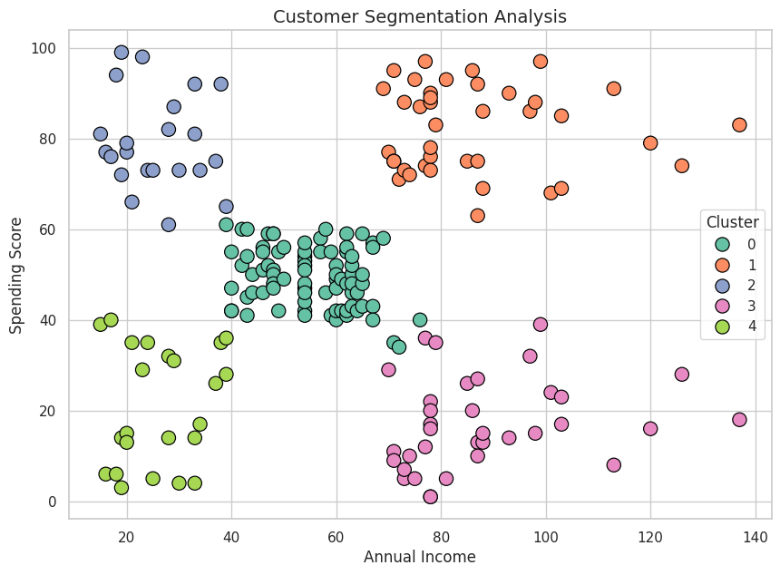
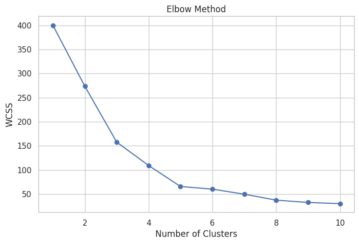
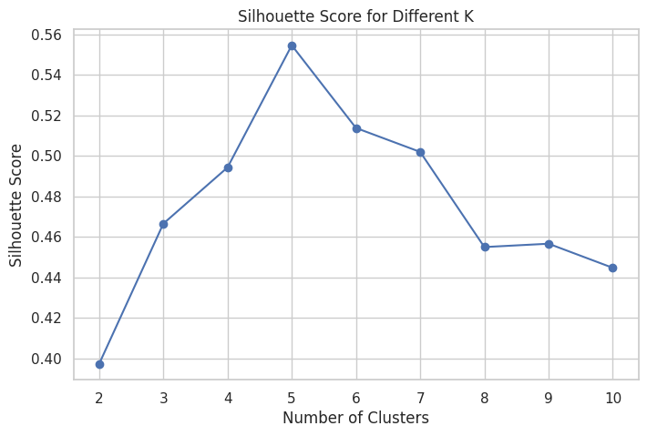

# 🧠 Customer Segmentation using K-Means Clustering

## 🚀 Project Overview

This project focuses on segmenting customers based on their **Annual Income** and **Spending Score** using **K-Means Clustering**.

The goal is to identify distinct customer groups and provide **data-driven business strategies** to improve marketing efficiency and revenue.

---

## Installation

Clone the repository

[Click here for Git Clone](https://github.com/JaskarJeyabalan/customer-segmentation-kmeans.git)

Install dependencies

pip install -r requirements.txt

Run forecasting script

python src/swiggy_revenue_forecasting.py

---

## 📊 Dataset

* Mall Customer Segmentation Dataset (public dataset commonly used for clustering analysis)
* Features used:

  * Age
  * Annual Income
  * Spending Score

---

## ⚙️ Tech Stack

* Python
* Pandas
* NumPy
* Matplotlib & Seaborn
* Scikit-learn

---

## 🔍 Project Workflow

1. Data Loading & Cleaning
2. Exploratory Data Analysis (EDA)
3. Feature Selection & Scaling
4. K-Means Clustering
5. Elbow Method for optimal clusters
6. Silhouette Score validation
7. Cluster Profiling
8. Business Recommendations

---

## 📈 Key Insights

* Identified **5 distinct customer segments**
* Clear separation between high-value and low-value customers
* Spending behavior varies significantly across income groups

---

## 💼 Business Impact

* Enables **targeted marketing strategies**
* Helps identify **premium customers**
* Improves **customer retention**
* Optimizes **marketing budget allocation**

---

## 📊 Customer Segments

| Cluster | Description                        |
| ------- | ---------------------------------- |
| 0       | Moderate Income, Moderate Spending |
| 1       | High Income, Low Spending          |
| 2       | Low Income, High Spending          |
| 3       | Low Income, Low Spending           |
| 4       | High Income, High Spending         |

---

## 📷 Sample Output

Below are sample visualizations from the project:

- Customer Segmentation Scatter Plot  
- Elbow Method Graph  
- Silhouette Score Analysis





---

## 📌 Key Learnings

- Applied unsupervised learning for real-world problem
- Understood importance of feature scaling
- Evaluated clustering using Silhouette Score
- Converted data insights into business strategies

---

## 📁 Project Structure

```
customer-segmentation-kmeans/
│
├── data/
├── images/
├── notebooks/
├── src/
├── README.md
├── requirements.txt
```

---

## 🔥 Conclusion

This project demonstrates how machine learning can be used to **understand customer behavior** and drive **business decisions**.

---

## ⭐ Future Improvements

* Deploy as a web app
* Add real-time customer prediction
* Integrate with business dashboards

---

## 📌 Author

**Name:** Jaskar Jeyabalan S

**Email:** [jaskarjeyabalan@gmail.com](mailto:jaskarjeyabalan@gmail.com)

---
