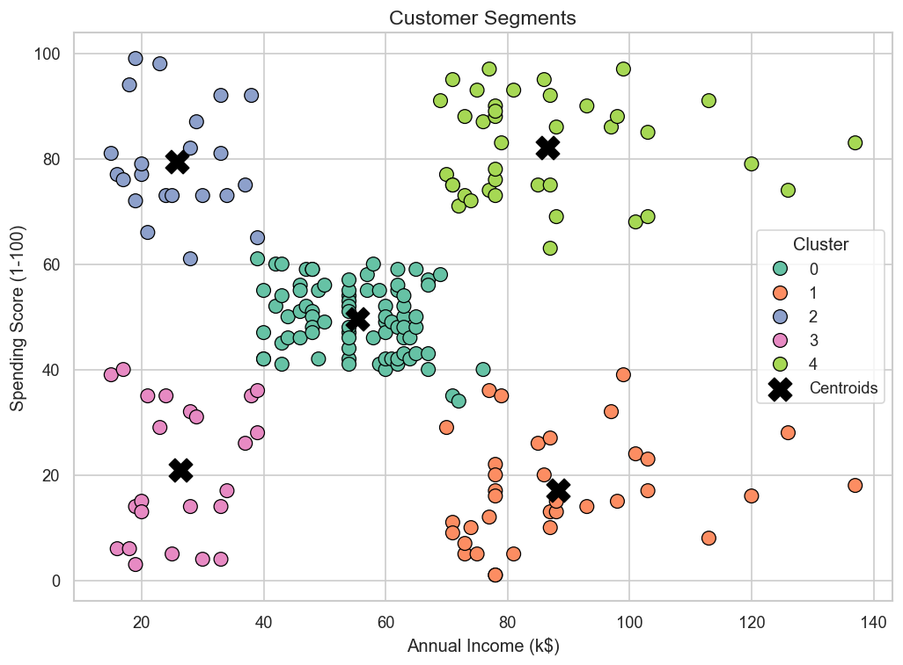
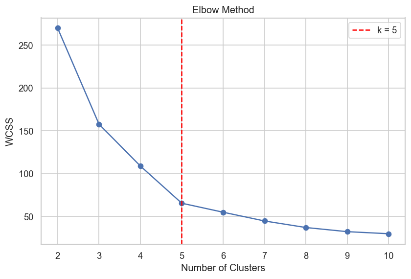
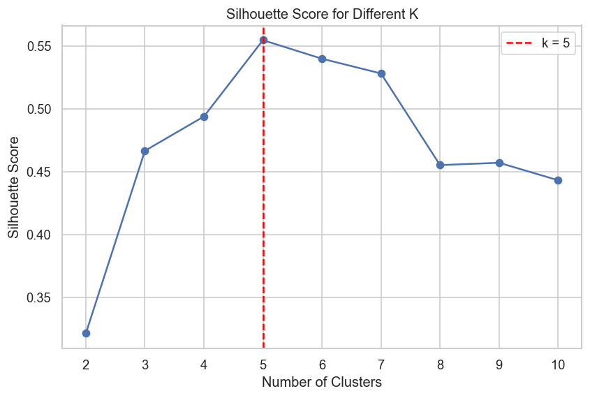

# Customer Segmentation using K-Means Clustering

## Project Overview

This project segments mall customers by **Annual Income** and **Spending Score** using **K-Means clustering**, then turns each segment into a practical marketing recommendation.

---

## Installation

```bash
git clone https://github.com/JaskarJeyabalan/customer-segmentation-kmeans.git
cd customer-segmentation-kmeans
pip install -r requirements.txt
```

## Usage

Run the script from the project root (it saves the charts to `images/`):

```bash
python src/customer_segmentation.py
```

Or open the notebook for the full step-by-step analysis with outputs:

```bash
jupyter notebook notebooks/customer_segmentation.ipynb
```

---

## Dataset

* Mall Customer Segmentation dataset (200 customers, public dataset commonly used for clustering practice)
* Columns: CustomerID, Gender, Age, Annual Income (k$), Spending Score (1-100)
* No missing values and no duplicate rows
* **Features used for clustering:** Annual Income and Spending Score (scaled with `StandardScaler`).
  Age was tested but lowered the silhouette score (about 0.41 vs 0.55), so it was left out.

---

## Tech Stack

Python, Pandas, NumPy, Matplotlib, Seaborn, Scikit-learn

---

## Project Workflow

1. Data loading and validation
2. Exploratory data analysis (EDA)
3. Feature selection and scaling
4. Choosing k with the elbow method
5. Silhouette score validation (k = 2 to 10)
6. K-Means clustering (k = 5)
7. Cluster profiling
8. Business recommendations

---

## Key Results

* The elbow method flattens at **k = 5**, and k = 5 also has the **highest silhouette score (0.555)** of the values tested.
* **5 customer segments** were identified.
* Segment names are assigned from each cluster's centroid values, so cluster IDs stay consistent between runs.

| Cluster | Segment | Customers | Avg. Income (k$) | Avg. Spending Score | Avg. Age |
| ------- | ------- | --------- | ---------------- | ------------------- | -------- |
| 0 | Moderate Income, Moderate Spending | 81 | 55.3 | 49.5 | 42.7 |
| 1 | High Income, Low Spending | 35 | 88.2 | 17.1 | 41.1 |
| 2 | Low Income, High Spending | 22 | 25.7 | 79.4 | 25.3 |
| 3 | Low Income, Low Spending | 23 | 26.3 | 20.9 | 45.2 |
| 4 | High Income, High Spending | 39 | 86.5 | 82.1 | 32.7 |

---

## Business Recommendations

| Cluster | Strategy |
| ------- | -------- |
| 0 | Regular offers, loyalty programme, upsell mid-range products |
| 1 | Personalised campaigns and premium recommendations to convert high purchasing power into sales |
| 2 | Discounts, budget bundles, volume-based promotions |
| 3 | Keep marketing spend low; target only during major sales |
| 4 | Premium segment: VIP membership, exclusive deals, early access, retention focus |

These recommendations come from the segment profiles. Their real impact would need to be tested, for example with A/B campaigns.

---

## Sample Output





---

## Project Structure

```
customer-segmentation-kmeans/
├── data/
│   └── Mall_Customers.csv
├── images/
├── notebooks/
│   └── customer_segmentation.ipynb
├── src/
│   └── customer_segmentation.py
├── README.md
└── requirements.txt
```

---

## Limitations and Future Improvements

* Small (200 rows), clean, well-known dataset, so results are for learning and demonstration
* Only two features are used; richer behavioural data (purchase history, recency, frequency) would give better segments
* Try other algorithms (e.g. DBSCAN, hierarchical clustering) and compare
* Deploy as a simple web app to predict the segment of a new customer

---

## Author

**Jaskar Jeyabalan S**
Email: [jaskarjeyabalan@gmail.com](mailto:jaskarjeyabalan@gmail.com)
